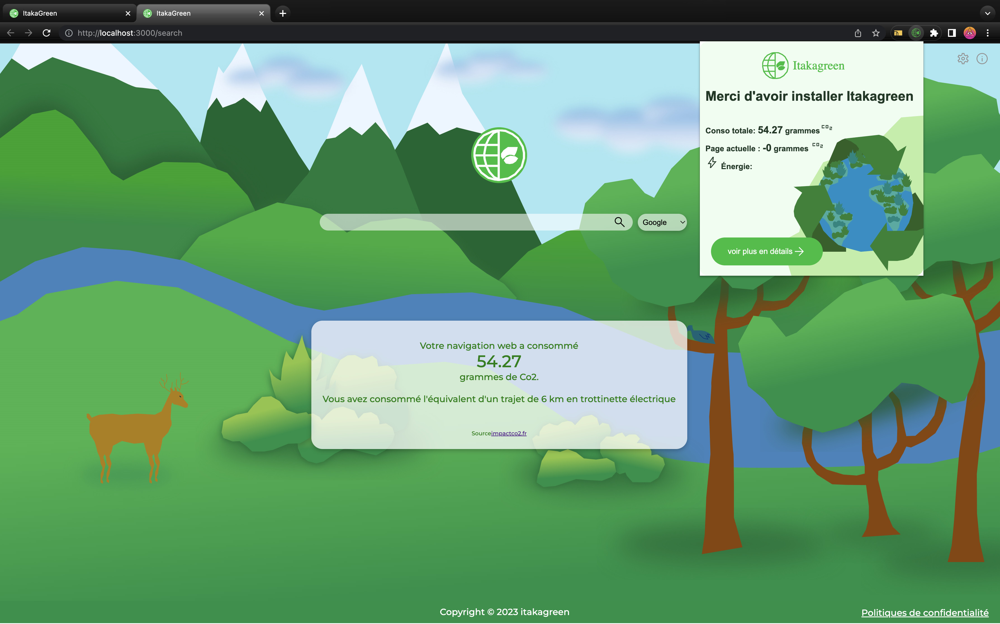

# Itakagreen Project

[](https://itakagreen.tech/)

To launch the project locally clone the project and follow instructions

Before Launching the docker's project you need to go through the following steps and fulfill the requirements.

You need to have Google Cloud API and service project running in order to get the secrets and use the extension (
https://console.developers.google.com/ 
)

To be able to use Itakagreen extension in production you need to send us a request with your login email. The Oauth cloud being in test mode on our part.

## .env
- Create the .env for docker-compose at the root of the project following the schema in ```.env.exemple```

## API
in ```./api```
- Create the .env for docker-compose for api/ directory following the schema in ```api/.env.exemple```

and run ```npm install``` 

## Front
in ```./front```
- Create the .env for docker-compose for front/ directory following the schema in ```front/.env.exemple```

and run ```npm install``` 

## Extension
in ```./extension```
- Create the .env for docker-compose for extension/ directory following the schema in ```extension/.env.exemple```

and run ```npm install``` 

To  be able to add the extension in Chrome you need to build the extension by running ```npm run dev ``` for dev environment 

or 

```npm run build``` for production environnement.

This will create a dist file in ./extension.
Go to the Chrome extension manager 
- activate the development mode 
- add the folder ```./extension/dist``` by clicking on LoadUnpack 

Finally go back to root project and run 
- ```docker compose up -d ```

If you modify the .env or the Dockerfile the flag ``` --build``` will have to be added to the docker compose commande.


# Licence
[Licence Open Source](https://github.com/it-akademy-students/handson-2023-1-equipe-3/blob/main/LICENSE)


# PRODUCTION
[](https://itakagreen.tech/)

We have setup a reverse proxy to call the different app services so we dont need expose publicly the different port.

# School project organisation 
This app was realized to answer the requirement of school project for the INTERSESSION 2023 It-Akademy

Checkout our [Miro](https://miro.com/app/board/uXjVP1t4bbs=/?share_link_id=981191534869) to see the organisation during these 3 weeks

# API Documentation
A full Postman_collection Json is provided in the ```./ressource``` 

# Design
We created all the assets in the project, that include illustration, logo and branding.
To do so we used the student licence of adobe XD and illustrator.
All the media are in svg format for optimisation.


# Présentation 
You'll find the qualitative Canva presentation we used at the end of our project at ```./ressource```.